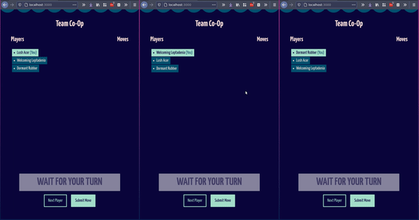

# Team Co-Op

This is a tool to play RPG-like games with a big group of people.



1. All users who access the page will join as a player.
2. Each player takes a turn at giving an instruction to the game master, such as `go north` or `pick up sword`
3. The system will pick a random player each turn.
4. Press "Next Player" if someone is AFK

# Features

## Backend

- The backend is an express server written in node and uses socket.io for client communications.
- The game currently only has a single lobby.
- There's no hard limit of players or actions.
- The server doesn't keep a copy of the move history.
- The server assigns a random name to each player composed of an adjective and the name of a tree (e.g. "Healthy Cedrela").

## Frontend

- The frontend is vanilla javascript/css/html - no extra dependencies.
- The client connects to the server right away.
- If you refresh your page, you'll be assigned a new name - the server will forget your previous user
- Click the 🌓 icon to toggle dark mode. This setting is currently not presisted between sessions.
- The move history is also not saved between sessions.
- The app is only losely responsive and works best in Landscape orientation.

# Running locally

Install dependencies and run

```
yarn
yarn dev
```

Access the app in `localhost:3000`.

# Deploying

The app is currently automatically [deployed in Heroku](https://team-co-op.herokuapp.com/) when new commits are pushed to master.

# TODO

I would still like to improve this tool if  I find myself using it more.

- Improve mobile responsiveness
- Allow multiple separate lobbies
- Create "game master view"
